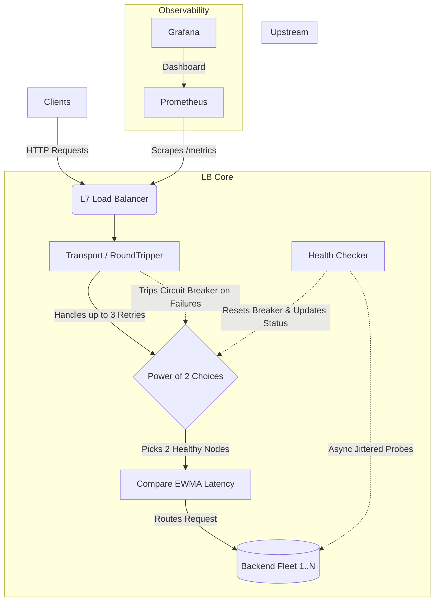

# P2C Load Balancer

A high-performance, concurrent Layer 7 load balancer written in Go. Designed with heavy traffic distribution algorithms (Power of Two Choices + EWMA), active jittered health monitoring, a fully observable metrics pipeline, and backend hot swapping.


## Architecture & Design



### 1. Power of Two Choices (P2C) with EWMA
Instead of traditional Round Robin or pure Least Connections (which often leads to a "thundering herd" problem), the balancer routes traffic using the **power of two choices** algorithm. For every request, the LB randomly selects two healthy backends, computes an **exponentially weighted moving average** of request latencies for both, and chooses the one with the faster response time. This ensures latency spikes are smoothed out and the LB reacts to recent, sustained degradation rather than micro-spikes.

### 2. Active Health Checking
Each backend has an `Alive` variable that is managed by its own active health-checker, a goroutine that periodically determines whether it is able to properly receive requests. If it fails a check, the variable is set and the selection algorithm ignores that backend. It will remain out of the pool until it returns a `200 OK` to the health-checker. Additionally, to prevent overwhelming backends on startup, the `healthLoop` implements randomized jitter (up to 3 seconds) before initiating the first probe. 

Active health checks are essential for reintroducing backends that have been taken out of the selection pool. Pinging backends that haven't seen traffic in a while is also a great way to ensure they haven't become inoperative in the background.

### 3. Circuit Breaking & Transparent Retries
Each backend also has a `CircuitState` variable that is managed by my custom implementation of `http.RoundTrip`. On each attempt, the function creates a shallow copy of the request and routes it to the selected backend. If a backend fails 3 times, `CircuitState` is set to `stateOpen` and the selection algorithm will run once more. 

After 3 retries (not to be confused with individual backend fails), the user's request will gracefully error out and be sent to the standard logger. This process ensures that one faulty backend doesn't cause a request to fail immediately and makes the process relatively seamless for the user.

It is also very important to only retry idempotent requests (those that don't change the state of the system, regardless of how many times they are made). If we allow a `POST`, for example, to retry, it might go through twice. Depending on your application, this could cause undesirable behavior, such as charging a user's credit card twice.

### 4. Hot Swapping
This load balancer supports hot swapping as well. Sending a `SIGHUP` to the program will cause it to update the list of backends to match `config.yml`'s state at that time. This is done via an atomic pointer swap to prevent lock contention. When a backend is removed, the balancer allows its current connections to drain before removing it from the registry completely, preventing user requests from being dropped unnecessarily.

Allowing backends to be removed and added without taking the balancer itself down is incredibly important in production environments; even a few seconds of balancer downtime could lead to thousands of dropped connections depending on throughput.

### 5. Avoidance of Mutex Use
The balancer's core routing state was intentionally designed to be lock-free, and thus avoids mutexes when possible. If two goroutines fight over a mutex, the losing goroutine is suspended by the Go scheduler and the OS has to do a thread context switch, which is expensive. To modify values in the hot path, atomics are used instead -- they use low-level CPU instructions to modify memory without descheduling the thread, which saves a ton of overhead.

Mutexes will indeed show up on the CPU profile, though, as connection pooling, Prometheus, etc. still need to use them.

## Benchmarks

I used several benchmarking tools to ensure that the hot path was as lock-free and efficient as possible. 

**Note**: Because the load generator, balancer, and backends are all being run on the same computer, they are actively competing for the same CPU cycles and network stack resources, so the LB's true limits aren't what's being tested here. If I wanted to do that, I'd run all 3 components on different devices and connect them via ethernet or thunderbolt 4.

Regardless, we can still confirm that the CPU is not the bottleneck and get some baseline numbers.

### Throughput & Latency (`hey`)
`hey` is an open-source load testing tool created by [@rakyll](https://github.com/rakyll). We can run the command below to simulate 300 concurrent workers sending in a total of 300000 requests. 

```bash
hey -n 300000 -c 300 http://localhost:8080/
```

I was able to get about ~40k RPS with a ~20ms p99 latency on average across 10 trial runs, one of which is shown below.


### CPU & Goroutine Profiling (`pprof`)
`pprof` is Go's native profiling tool that collects runtime data like CPU usage, memory allocations, and goroutine blockages. A flame graph of CPU usage is shown below.


Upon examination, we can see that the balancer is largely I/O bound -- `syscall.Syscall6`, `bufio.Writer.Flush`, and `net.conn.Write` dominate CPU time, which is expected for a proxy doing twice the socket work of a direct connection. The application logic does not appear as a visible CPU consumer, which confirms that the hot path is efficient.

Something that stuck out, though, was `runtime.mallocgc` at 8%, which made me look deeper into the alloc profile. It turns out that `httputil.ReverseProxy` is mostly responsible for this, as it deeply clones requests internally. This is an unavoidable cost of using Go's proxy library -- as far as an L7 LB goes, this one is (roughly) at the floor for allocs.

### Observability (Grafana)
Every routing decision and health status change also exports Prometheus metrics. The included dashboard shows 6 critical statistics: traffic distribution per backend, HTTP 5xx error rate, active connections per backend, total requests per second, p99 latency per backend, and overall average system latency.


## Run It Yourself

### Prerequisites
- **Go 1.21+** — [golang.org/dl](https://golang.org/dl/)
- **Make** — pre-installed on macOS and Linux; Windows users should use WSL
- **Docker with the Compose plugin** — [Docker Desktop](https://www.docker.com/products/docker-desktop/) includes this on macOS and Windows; Linux users see the [Compose plugin install guide](https://docs.docker.com/compose/install/linux/)

### Running Locally
1. Clone the repository and download dependencies:
   ```bash
   git clone https://github.com/glcon/load-balancer.git
   cd load-balancer
   go mod download
   ```

2. Spin up the full cluster (Load Balancer, 5× Nginx backends, Prometheus, Grafana):
   ```bash
   make infra-up
   ```
   The first run will build the Go binary inside Docker, which may take 30–60 seconds.

3. Test the balancer:
   ```bash
   curl http://localhost:8080/
   ```
   For load testing, install [`hey`](https://github.com/rakyll/hey) and run:
   ```bash
   hey -z 15s -c 200 http://localhost:8080/
   ```

4. View metrics:
   - **Grafana** dashboard: `http://localhost:3000` (may take ~10 seconds to come up). Navigate to **Dashboards** and open **lb-dashboard**. Set the time range to **Last 5 minutes** and enable **auto-refresh** to stream live stats.
   - **Prometheus** UI if you'd like it: `http://localhost:9091`
   - **pprof HTML index**: `http://localhost:6060/debug/pprof/` -- live goroutine counts, heap usage, and thread stats.
   - To capture a CPU flame graph under load, run this in a separate terminal:
      ```bash
      go tool pprof -http=:8888 http://localhost:6060/debug/pprof/profile?seconds=10
      ```

5. Tear down:
   ```bash
   make infra-down
   ```

### Other Makefile targets
Run `make help` in the project root to see other actions, including `make test` (runs the unit test suite with the race detector) and `make run` (runs the balancer locally without Docker).

## Configuration
Managed via `configs/config.yml`:

```yaml
listen_addr: ":8080"
metrics_addr: ":9090"
pprof_addr: ":6060"
health_check_interval: 5
backends:
  - id: "backend-1"
    url: "http://backend1:5678"
  - id: "backend-2"
    url: "http://backend2:5678"
  # ... Add as many targets as needed
```

## Future Improvements
- **Layer 4 (TCP) Balancing:** Right now, this is strictly an L7 balancer. I'd love to drop down a level and add raw socket routing capabilities to handle arbitrary TCP traffic as well.
- **Dynamic Service Discovery:** While the hot-swapping feature works well, integrating with something like Consul or etcd would allow backends to dynamically register and deregister themselves so I don't have to touch the `config.yml` at all.
- **Consistent Hashing:** It would be great to introduce a routing strategy based on client headers or IPs to guarantee sticky sessions. This would be incredibly useful for specific tenants that need to always hit the same backend state or cache.
