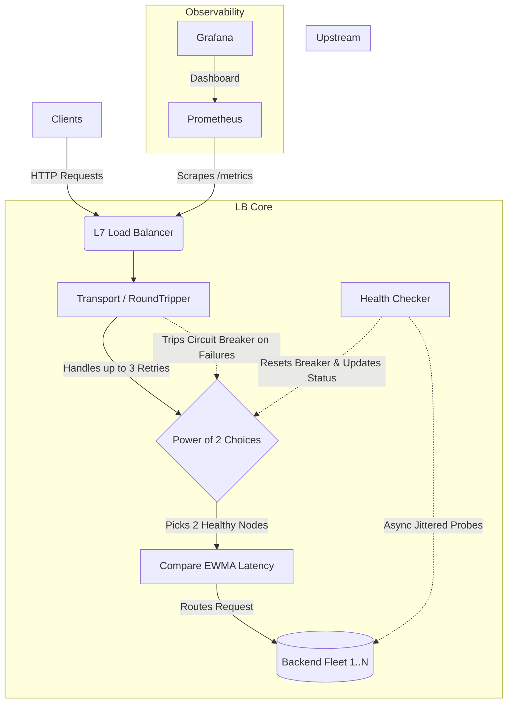
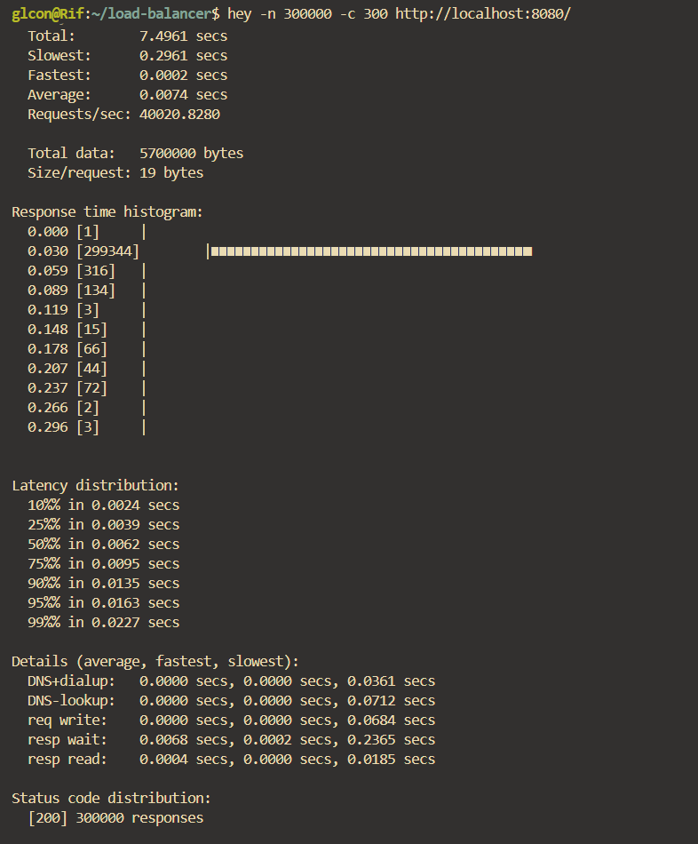
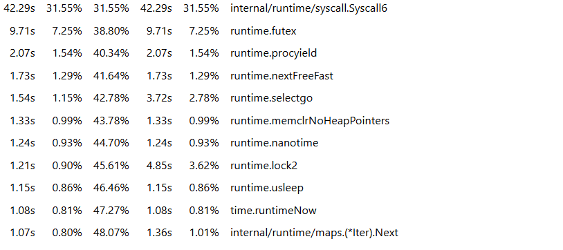
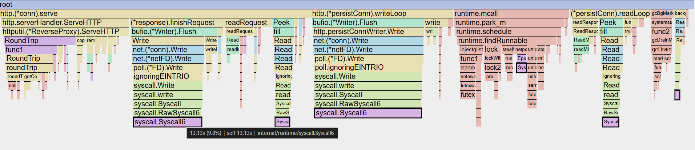
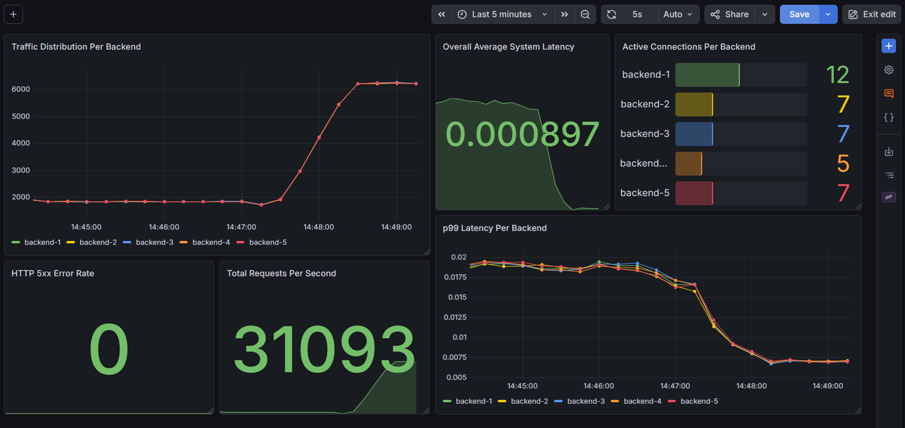

# P2C Load Balancer

A high-performance, concurrent Layer 7 load balancer written in Go. Designed with heavy traffic distribution algorithms (Power of Two Choices + EWMA), active jittered health monitoring, a fully observable metrics pipeline, and backend hot swapping.


## Architecture & Design



### 1. Power of Two Choices (P2C) with EWMA
Instead of traditional Round Robin or pure Least Connections (which can cause a "thundering herd" problem), the balancer routes traffic using the **power of two choices** algorithm. For every request, the LB randomly selects two healthy backends, compares their load, and sends the request to the one with the least load. Load is not measured by active connections, but rather by an **exponentially weighted moving average** of request latencies. This ensures latency spikes are smoothed out and the LB reacts to recent, sustained degradation rather than micro-spikes.

### 2. Active Health Checking
Each backend has an `Alive` variable that is managed by its own active health-checker, a goroutine that periodically determines whether it is able to properly receive requests. If it fails a check, the variable is set and the backend is immediately ignored by the selection algorithm. It will remain out of the pool until it returns a `200 OK` to the health-checker. Additionally, to prevent overwhelming backends on startup, the `healthLoop` implements randomized jitter (up to 3 seconds) before initiating the first probe. 

Active health checks are essential for reintroducing backends that have been taken out of the selection pool. Pinging backends that haven't seen traffic in a while is also a great way to ensure they haven't become inoperative in the background.

### 3. Circuit Breaking & Transparent Retries
Each backend also has a `CircuitState` variable that is managed by my custom implementation of `http.Roundtrip`. The function clones the request body and attempts to serve it; if it fails, that backend's `CircuitState` will be set to `stateOpen` and it will run the selection algorithm again. After 3 retries, the user's request will gracefully error out and be sent to the standard logger. This ensures that one faulty backend does not cause a request to fail immediately and makes the process more seamless for the client/user.

### 4. Hot Swapping
This load balancer supports hot swapping as well. Sending a `SIGHUP` to the program will cause it to update the list of backends to match `config.yml`'s state at the time. This is done via an atomic pointer swap, which helps prevent lock contention. Allowing backends to be removed and added without taking the balancer itself down is incredibly important in production environments; even a few seconds of balancer downtime could lead to thousands of dropped connections and lost revenue.

### 5. No Mutex Use
I also intentionally did not use `sync.RWMutex` or `sync.Mutex` when making the balancer. Mutexes are great when you need to implement complex state changes, but for high throughput tools like this one, their locks can quickly become a massive bottleneck, leading multiple worker threads to stall while fighting over a single shared resource. Instead, this architecture relies on atomic operations, which occur in a single cpu cycle, to avoid this. Mutex use will still show up in the CPU profile, though, which will be explained shortly.

## Benchmarks

To validate the algorithmic choices and ensure that the balancer worked under high-throughput, I used several benchmarking tools, which are outlined below. 

Because the load generator and the balancer are both being run on the same computer, they are actively competing for the same CPU cycles and network stack resources. This promotes rapid context switching on the OS's part and introduces a lot of lock contention in the Go runtime as well. Thus, the numbers below represent more of a hardware bottleneck than the maximum performance of the routing logic itself; nevertheless, they give a good general idea of what the tool is capable of.

### Throughput & Latency (`hey`)
`hey` is an open-source load testing tool created by [@rakyll](https://github.com/rakyll). We can run the command below to simulate 300 concurrent workers sending in a total of 300000 requests. 

```bash
hey -n 300000 -c 300 http://localhost:8080/
```

I was able to get about ~40k RPS with a ~20ms p99 latency on average across 10 trial runs, one of which is shown below.



### CPU & Goroutine Profiling (`pprof`)
`pprof` is Go's native profiling tool that's used to collect runtime execution data like CPU usage, memory allocations, and goroutine blockages. I used it to confirm that there were no goroutine leaks and analyze cpu usage under local load:



`syscall.Syscall6` reflects the core heavy lifting of the load balancer -- constantly moving bytes between client and backend sockets over the local network.

`runtime.futex` and `runtime.procyield` are both indicators of internal sync overhead. Because the load generator (`hey`) is violently slamming the system on the same machine, goroutines are frequently forced to pause for a short time while waiting for access to shared standard library resources, which is the main reason these two represent 8.79% of the CPU's total usage combined.

Otherwise, the profile looks normal and indicates minimal resource contention. I've included a flame graph below as well for visualization.



### Observability (Grafana)
Every routing decision and health status change exports Prometheus metrics. The included dashboard provides real-time telemetry for 6 critical statistics: traffic distribution per backend, HTTP 5xx error rate, active connections per backend, total requests per second, p99 latency per backend, and overall average system latency.



## Run It Yourself

### Prerequisites
- Docker & Docker Compose

### Running Locally
1. Clone the repository.
2. Spin up the cluster (Load Balancer, 5x Demo Backends, Prometheus, Grafana):
   ```bash
   make infra-up
   ```
3. Test the balancer:
   ```bash
   curl http://localhost:8080/
   ```
   You can also use `hey` or any comparable load testing tool should you have one installed.

4. Viewing Metrics:
   - A custom **Grafana** dashboard is hosted at `http://localhost:3000`. It might take 5-10 seconds to go live. When visiting for the first time, you will need to click on **Dashboards** in the top left corner and select **lb-dashboard**, which should be publicly accessible. Set the refresh rate to **auto** to stream statistics live.
   - **Prometheus's** standard UI is hosted at `http://localhost:9091`

### Makefile
- You can run `make help` while in the project root to view a list of quick actions as well.


## Configuration
Managed via `configs/config.yml`:

```yaml
listen_addr: ":8080"
metrics_addr: ":9090"
pprof_addr: ":6060"
health_check_interval: 5
backends:
  - id: "backend-1"
    url: "http://backend1:5678"
  - id: "backend-2"
    url: "http://backend2:5678"
  # ... Add as many targets as needed
```

## Future Improvements
- **Layer 4 (TCP) Balancing:** Right now, this is strictly an L7 balancer. I'd love to drop down a level and add raw socket routing capabilities to handle arbitrary TCP traffic as well.
- **Dynamic Service Discovery:** While the hot-swapping feature works well, integrating with something like Consul or etcd would allow backends to dynamically register and deregister themselves so I don't have to touch the `config.yml` at all.
- **Consistent Hashing:** It would be great to introduce a routing strategy based on client headers or IPs to guarantee sticky sessions. This would be incredibly useful for specific tenants that need to always hit the same backend state or cache.
